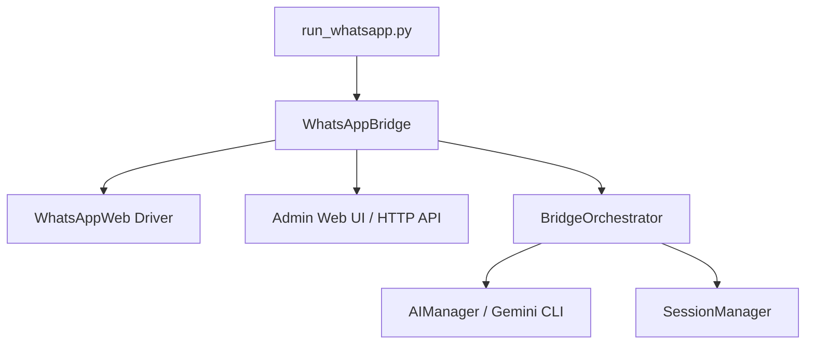
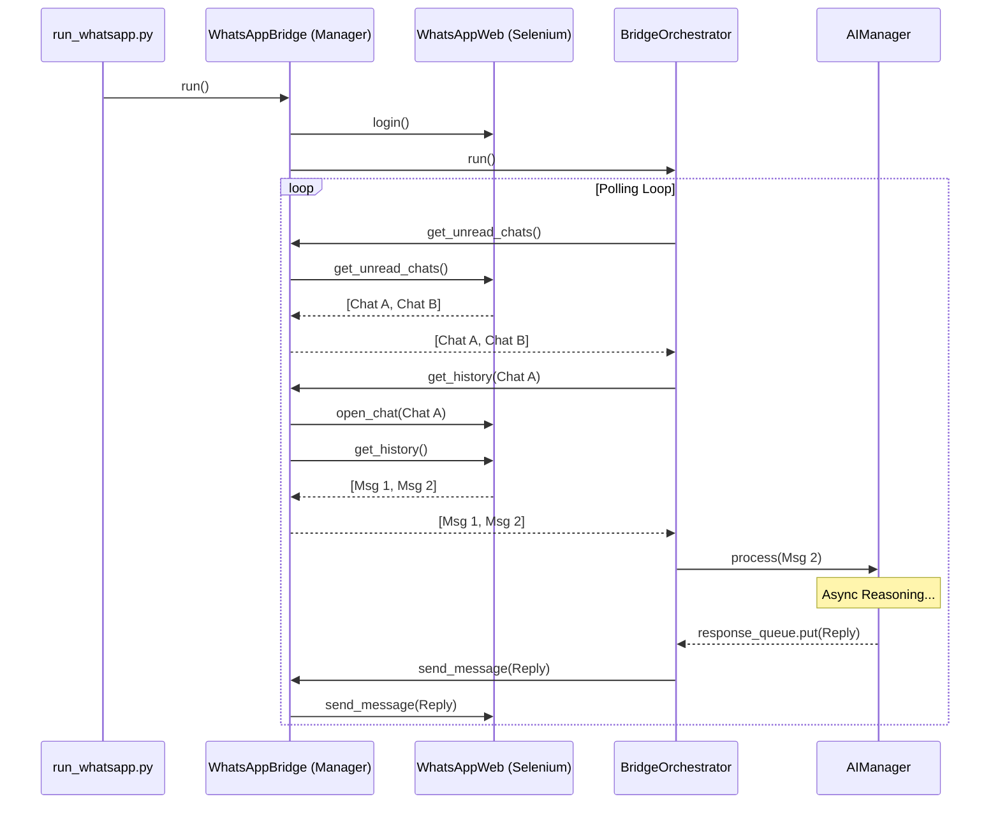
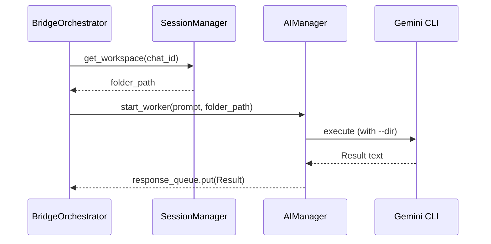

# WhatsApp Bot Architecture

This document describes the internal structure and communication flow of the WhatsApp Supervisor Bot. The system is designed for high reliability, async execution, and rich administrator control.

---

## 1. System Overview

The bot follows a layered architecture where low-level driver details are abstracted from the high-level AI reasoning and session management.

### 1.1 `run_whatsapp.py` (The Multi-Process Launcher)
- Handles environmental configuration and logging.
- Implements a **Crash Recovery Loop**: Automatically restarts the bridge if the browser crashes or losing connection.
- Supports **Mock Mode**: Can patch the AI Manager for local testing without spending API quota.

---

## 2. Core Components

### 2.1 `WhatsAppBridge` (`bridge.py`)
The central coordinator that wires everything together.
- **Session Lifecycle**: Provides the public API for `register_chat`, `unregister_chat`, and `reset_chat`.
- **Media Processing**: Intercepts media messages, downloads them via the driver, and prepares them for the AI.
- **API Server Integration**: Starts the FastAPI admin server in a background thread.

### 2.2 `WhatsAppWeb` Driver (`driver.py`)
Low-level Selenium-based glue for WhatsApp Web.
- **Thread Safety**: Uses a `threading.RLock()` to synchronize access to the Selenium driver. This ensures the Dashboard and the Orchestrator don't clash when switching chats.
- **Smart Chat Switching**: Uses the search-box logic (instead of page reloads) for stability.
- **Self-Detection**: Identifies variants of "Du" / "You" to prevent infinite switching loops when the bot views its own chat.
- **The Emoji Fix**: Bypasses Selenium's BMP character limitation using JavaScript `document.execCommand('insertText', ...)` injection.
- **Deep Linking**: Transparently supports phone-number-based opening via `web.whatsapp.com/send/?phone=...` if fallback is needed.

### 2.3 `AdminServer` (`admin_server.py`)
A FastAPI application that provides:
- **Visual Dashboard**: Real-time view of active sessions, detected channels, and event logs.
- **Session Inspector**: Deep-dive view of any active workspace (`OBJECTIVE.md`, `TODO.md`, and recent logs).
- **HTTP API**: The `/send` endpoint allows external systems (or manual tests) to trigger messages via `GET` requests.

---

## 3. Key Logic Flows

### 3.1 Polling & Message Processing
The orchestrator drives the main loop by polling the bridge for updates.

### 3.2 AI Routing & Context Flow
When an agent "thinks," it operates within its own dedicated workspace.

---

## 4. Maintenance & Troubleshooting

### 4.1 Common Breakpoints
- **DOM Selector Changes**: WhatsApp frequently updates CSS classes. Check `div[data-id]` (messages) and `div[data-tab='3']` (search box) first.
- **JID Guard**: The bridge implements a security layer that prevents mapping group JIDs to phone number identities, protecting against session cross-talk.
- **Robust Matching**: Uses normalization to handle discrepancies between UI titles (e.g., "Du") and registered identities.
- **Rate Limiting**: The orchestrator enforces a 2-second per-chat cooldown and a global cooldown to avoid spam detection.
- **Quota Management**: If a "quota exhausted" error is detected from Gemini, the orchestrator automatically enters a 5-minute back-off mode across all chats.

### 4.2 Logging
- **Console**: Standard output follows the launcher's `TeeStream`.
- **`bridge_output.log`**: Full log history including system events and crashes.
- **`chat_history.log`**: A clean record of all user/bot messages for easy auditing.
- **`bridge_state.json`**: A machine-readable snapshot of the current bridge health.
